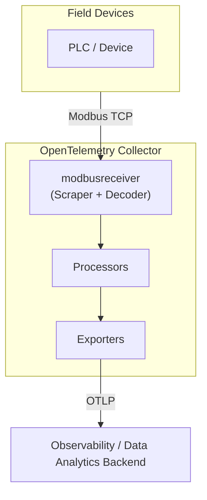

# modbusreceiver

[](https://golang.org)
[](../../../LICENSE)
[](https://github.com/otel-industrial/otel-industrial-resources/tree/main/otel-industrial-collector/receiver/modbusreceiver)

Modbus has been the standard protocol for industrial devices — PLCs, sensors, SCADA systems — since 1979, yet operational data from the factory floor rarely makes it into modern observability pipelines. The **modbusreceiver** changes that by extending the OpenTelemetry Collector into industrial environments, turning raw register and coil values into standard OTel metrics with no proprietary gateway or vendor lock-in required.

## Features

- **Modbus TCP** support (connect to any Modbus TCP device or gateway)
- **9 data types** — `bool`, `int16`, `int32`, `int64`, `uint16`, `uint32`, `uint64`, `float32`, `float64`
- **4 byte orders** — `ABCD` (big-endian), `DCBA` (little-endian), `BADC`, `CDAB` for full device compatibility
- **All 4 register banks** — coil (FC01), discrete input (FC02), holding register (FC03), input register (FC04)
- **Auto-derived register count** — no manual count needed; the receiver calculates how many registers to read based on data type
- **Lazy connection** — connects to the device on first scrape, reconnects automatically on failure
- **Rich metric attributes** — register address, unit ID, register type, data type, byte order, and optional name
- **Built-in simulator** — test without real hardware using the included Modbus TCP simulator
- **otelcol-contrib aligned** — structured to match official OpenTelemetry Collector contrib conventions, ready for upstream proposal

## Architecture



## Quick start

### Prerequisites

- Go 1.25+
- [OpenTelemetry Collector Builder (ocb)](https://github.com/open-telemetry/opentelemetry-collector/tree/main/cmd/builder) v0.152.0

```bash
go install go.opentelemetry.io/collector/cmd/builder@v0.152.0
```

> **Version alignment:** `ocb`, `otelcol_version` in `builder-config.yaml`, and OTel collector dependencies in `go.mod` must all match. This project uses `ocb v0.152.0` with collector components at `v1.58.0` / `v0.152.0`.

### 1. Clone and build

```bash
git clone https://github.com/otel-industrial/otel-industrial-resources.git
cd otel-industrial-resources/otel-industrial-collector/receiver/modbusreceiver
make build
```

This produces `./bin/otelcol-modbus` — a custom collector binary with the Modbus receiver built in.

### 2. Configure

Copy the example config and adjust it for your device:

```bash
cp config.example.yaml config.yaml
```

Edit `config.yaml` — at minimum set `endpoint` and `unit_id` to match your Modbus device, and update the `registers` list to match your device's register map (usually found in the device manual).

### 3. Run

```bash
make run
# or
./bin/otelcol-modbus --config config.yaml
```

### Local testing with the simulator

If you don't have a Modbus device available, use the included simulator:

```bash
# Terminal 1 — start the simulator
make simulate

# Terminal 2 — build and run the collector
make build && make run
```

The simulator serves fake sensor data (temperature, pressure, humidity, flow rate, pump/valve status) on `localhost:5020` with slowly drifting values.

## Configuration

```yaml
receivers:
  modbus:
    endpoint: "192.168.1.10:502"  # Modbus TCP host:port
    unit_id: 1                    # Modbus slave ID (1–247)
    polling_interval: 10s         # how often to poll
    timeout: 5s                   # per-request TCP timeout
    registers:
      - address: 0
        type: holding_register
        data_type: float32
        byte_order: ABCD
        name: "temperature"
```

### Register types

| `type`              | Modbus FC | Description                    |
|---------------------|-----------|--------------------------------|
| `coil`              | FC01      | Read/write single bits         |
| `discrete_input`    | FC02      | Read-only single bits          |
| `holding_register`  | FC03      | Read/write 16-bit registers    |
| `input_register`    | FC04      | Read-only 16-bit registers     |

### Data types

| `data_type` | Registers | Notes                      |
|-------------|-----------|----------------------------|
| `bool`      | —         | Coil / discrete input only |
| `int16`     | 1         |                            |
| `uint16`    | 1         |                            |
| `int32`     | 2         |                            |
| `uint32`    | 2         |                            |
| `float32`   | 2         | IEEE 754                   |
| `int64`     | 4         |                            |
| `uint64`    | 4         |                            |
| `float64`   | 4         | IEEE 754                   |

### Byte orders

| `byte_order` | Description                                    | Common devices           |
|--------------|------------------------------------------------|--------------------------|
| `ABCD`       | Big-endian (default)                           | Most PLCs                |
| `DCBA`       | Little-endian                                  | x86-style devices        |
| `BADC`       | Big-endian words, bytes swapped within word    | Some Schneider devices   |
| `CDAB`       | Little-endian words, bytes swapped within word | Some ABB devices         |

If decoded values look wrong, try a different byte order — consult your device manual.

## Metrics

### `modbus.register.value`

Decoded value from a holding or input register. Signed integer types (`int16/32/64`) are emitted as int gauge; unsigned and float types as double gauge.

### `modbus.coil.value`

Binary value (0 or 1) from a coil or discrete input, emitted as int gauge.

Both metrics share these attributes:

| Attribute                 | Description                        |
|---------------------------|------------------------------------|
| `modbus.register_address` | Register address                   |
| `modbus.unit_id`          | Modbus unit/slave ID               |
| `modbus.register_type`    | Register bank type                 |
| `modbus.data_type`        | Data type used for decoding        |
| `modbus.byte_order`       | Byte order used for decoding       |
| `modbus.name`             | Optional name from config          |

Full metric documentation is auto-generated in [documentation.md](documentation.md) by `mdatagen` from [metadata.yaml](metadata.yaml).

## Project structure

This receiver follows the [otelcol-contrib conventions](https://github.com/open-telemetry/opentelemetry-collector-contrib/blob/main/CONTRIBUTING.md) and is structured to be ready for an upstream proposal:

```
modbusreceiver/
├── config.go                   # Config struct and validation
├── doc.go                      # go:generate mdatagen directive
├── factory.go                  # OTel ComponentFactory registration
├── receiver.go                 # Lifecycle management and poll loop
├── scraper.go                  # Modbus TCP client, decode, metric emission
├── metadata.yaml               # Metric definitions (source of truth)
├── documentation.md            # Auto-generated metric docs (from mdatagen)
├── generated_component_test.go # Auto-generated component tests
├── generated_package_test.go   # Auto-generated package tests
├── internal/
│   └── metadata/               # Auto-generated from metadata.yaml
│       ├── generated_config.go
│       ├── generated_metrics.go
│       └── generated_status.go
├── testdata/
│   └── config.yaml             # Test configuration
├── cmd/
│   └── simulator/              # Modbus TCP simulator for local testing
│       └── main.go
└── builder-config.yaml         # OCB manifest for building the collector
```

To regenerate `internal/metadata/` after editing `metadata.yaml`:

```bash
# Install mdatagen (requires cloning the collector repo)
git clone --depth=1 --branch v0.152.0 https://github.com/open-telemetry/opentelemetry-collector.git
cd opentelemetry-collector/cmd/mdatagen && go build -o ~/go/bin/mdatagen .

# Regenerate
cd ~/your/modbusreceiver
go generate ./...
```

## Using as a library

Add this receiver to your own custom collector distribution via `builder-config.yaml`:

```yaml
receivers:
  - gomod: github.com/otel-industrial/otel-industrial-resources/otel-industrial-collector/receiver/modbusreceiver v0.0.1
```

## Development

```bash
make test    # run tests
make lint    # run linter (requires golangci-lint)
make tidy    # tidy go modules
make clean   # remove build artifacts
```

## Cardinality considerations
 
Each combination of metric attributes creates a unique time series in your metrics backend. For this receiver, cardinality is determined by:
 
```
time series = number of registers × unique (unit_id, register_type, data_type, byte_order, name)
```
 
Since all attributes are derived from your static `config.yaml`, cardinality is **fully predictable and bounded** — a 50-register config produces exactly 50 time series, regardless of polling frequency.
 
**Things to avoid:**
 
- Do not use dynamic or high-cardinality values in the `name` field (e.g. timestamps, UUIDs). The `name` field is meant for a short human-readable label like `"temperature"` or `"pump_status"`.
- If polling multiple Modbus devices at the same endpoint with different `unit_id` values using separate receiver instances, ensure each instance has a distinct configuration so time series remain distinguishable.
**Tip:** Use the `modbus.name` attribute in your dashboard queries to select specific registers rather than filtering on `modbus.register_address` — it makes dashboards more readable and is guaranteed to be low-cardinality.

## Troubleshooting

**Values look wrong (e.g. wildly large or negative numbers)**
Try a different `byte_order`. Most PLCs use `ABCD` but some use `CDAB` or `DCBA`.

**Connection refused**
Check that the `endpoint` and `unit_id` are correct and the device is reachable. Port 502 requires root on Linux/macOS — use a higher port for local testing.

**Collector exits immediately**
Check your `config.yaml` is valid YAML and all required fields (`endpoint`, `unit_id`, `polling_interval`, `timeout`, at least one register) are set.

## Roadmap

- [ ] Modbus RTU (serial) support
- [ ] Modbus ASCII support
- [ ] Write support (coils and holding registers)
- [ ] Scale factor and unit conversion per register (e.g. raw → °C)
- [ ] Register grouping — batch reads for consecutive addresses
- [ ] Integration tests with a Modbus TCP simulator
- [ ] Support for multiple devices (multiple `unit_id` targets per endpoint)

## Contributing

Contributions are welcome! Here's how to get started:

1. Fork the repository and create a feature branch:
   ```bash
   git checkout -b feat/my-feature
   ```

2. Make your changes, add tests, and ensure everything passes:
   ```bash
   make test
   go vet ./...
   ```

3. Follow the existing code style — the receiver follows the [OTel Collector contrib conventions](https://github.com/open-telemetry/opentelemetry-collector-contrib/blob/main/CONTRIBUTING.md).

4. Commit with a descriptive message following [Conventional Commits](https://www.conventionalcommits.org/):
   ```
   feat: add scale factor support for registers
   fix: handle reconnection after TCP timeout
   ```

5. Open a pull request against `main` — CI will run automatically.

### Areas especially welcome for contribution

- Device compatibility reports (byte order, data type findings for specific PLCs)
- Modbus RTU/ASCII transport implementation
- Additional test coverage for the decode logic

## License

Apache 2.0 — see [LICENSE](../../../LICENSE).